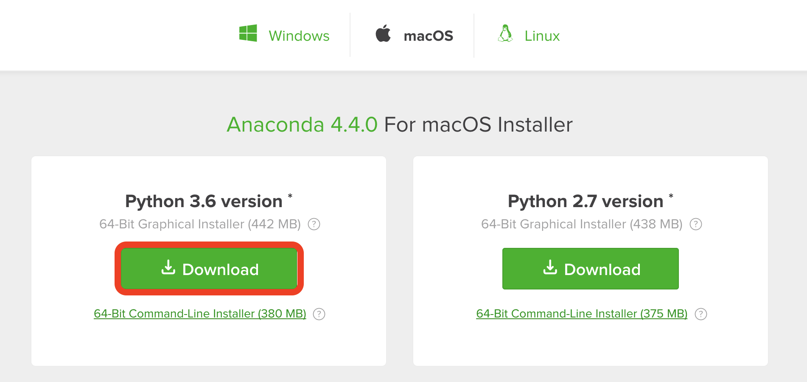
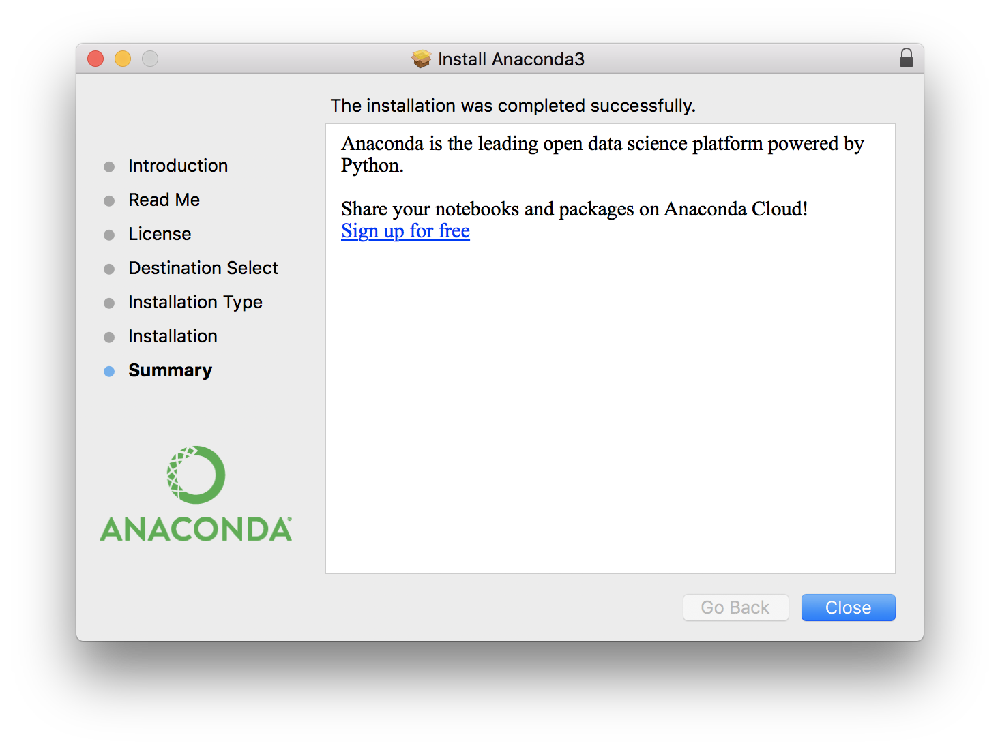
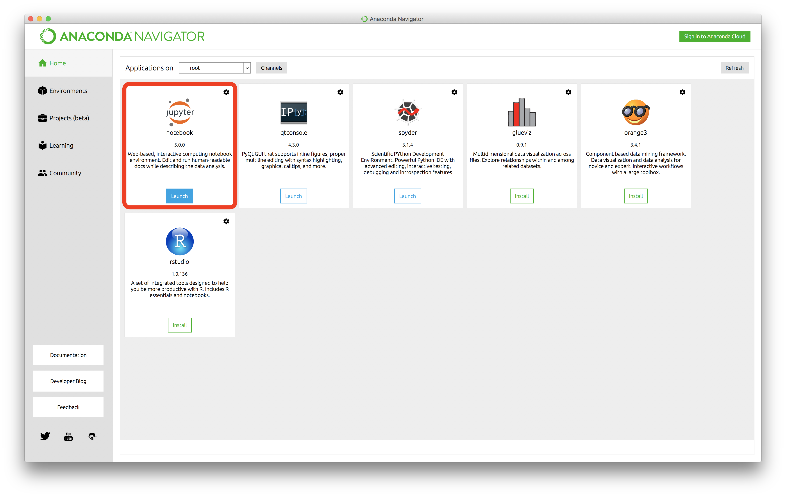
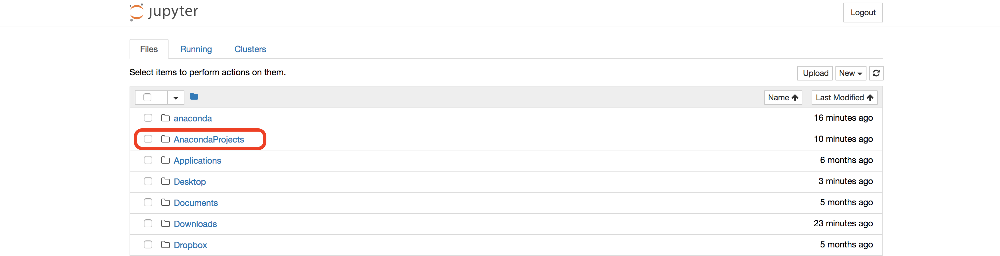

# Mac Environment SetUp

## Anaconda
* Popular data science packages included.
* Support Mac, Windows and Linux.
* Bulilt-in Jupyter Notebook

[Download Link](https://www.anaconda.com/download/)

### 1. Download Python3.6 for Mac Installer

### 2. Double click the installer

### 3. Continue, continue and continue...

### 4. Install for me only and continue...

### 5. Close!

### 6. Find Anaconda Navigator

### 7. Launch Jupyter Notebook on browser

### 8. Well Done! :sunglasses:

