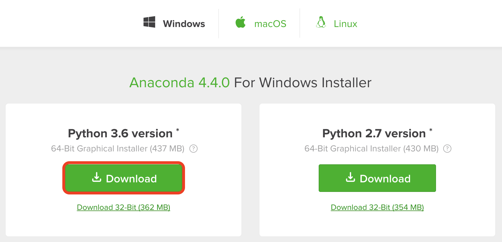
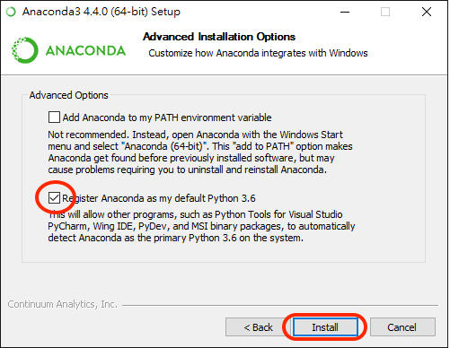
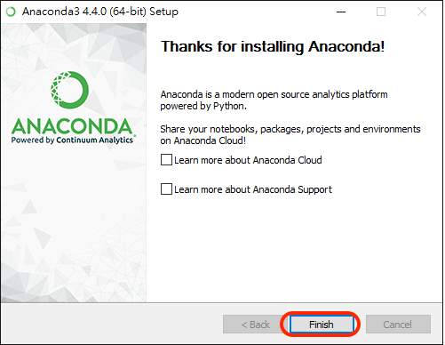
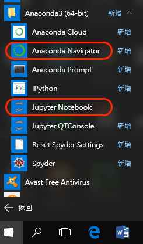
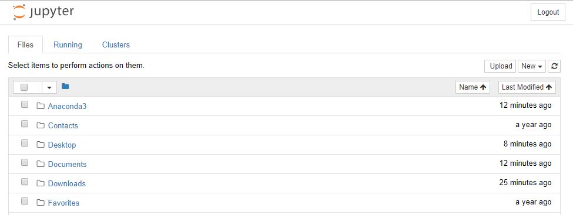

# Windows Environment SetUp

## Anaconda
* Popular data science packages included.
* Support Mac, Windows and Linux.
* Bulilt-in Jupyter Notebook

[Download Link](https://www.anaconda.com/download/)

### 1. Download Python3.6 for Mac Installer

### 2. Next, next and next...

### 3. Set Anacaonda as default python and install

### 4. Finish!

### 5. Anaconda Navigator and Jupyter Notebook

### 6. Well Done! :sunglasses:

